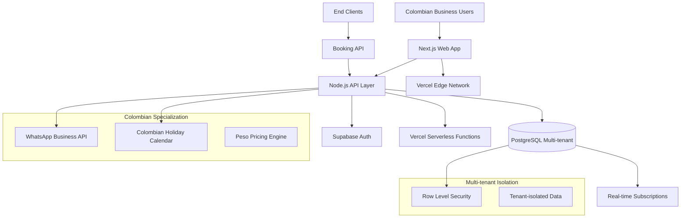

# Colombian Appointment Management System Fullstack Architecture Document

## Introduction

This document outlines the complete fullstack architecture for **Colombian Appointment Management System**, including backend systems, frontend implementation, and their integration. It serves as the single source of truth for AI-driven development, ensuring consistency across the entire technology stack.

This unified approach combines what would traditionally be separate backend and frontend architecture documents, streamlining the development process for modern fullstack applications where these concerns are increasingly intertwined.

The architecture prioritizes **pragmatic technology choices** using proven, boring technologies over cutting-edge solutions to ensure reliability within the 6-month MVP timeline. The system is designed as a **Colombian-first platform** rather than an international solution with Colombian features, making market specialization a core architectural principle. **Business isolation** serves as both a technical requirement and a key differentiator, while the overall design enables **progressive enhancement** from simple MVP to sophisticated business operations hub.

### Starter Template or Existing Project

**N/A - Greenfield project**

Based on comprehensive analysis, this requires a greenfield approach due to:
- **Colombian Market Specialization**: Holiday calendar integration, peso pricing, and WhatsApp-first communication are highly specific requirements
- **Multi-tenant Architecture**: Complete business isolation with zero cross-tenant visibility requires custom design patterns
- **Scheduling Engine Complexity**: 15-minute granular scheduling with real-time conflict prevention needs specialized transactional logic
- **Bootstrap Constraints**: Small team (2-3 developers) with 6-month timeline favors custom solution over template adaptation

### Change Log

| Date | Version | Description | Author |
|------|---------|-------------|---------|
| 2025-08-12 | 1.0 | Initial architecture document with step-by-step decision analysis | Winston (Architect) |
| 2025-08-12 | 1.1 | Enhanced with PRD requirements and Epic 1 infrastructure details | John (PM) |

## High Level Architecture

### Technical Summary

The Colombian Appointment Management System employs a **modular monolithic architecture** deployed as serverless functions, combining the development simplicity needed for a small team with the scalability required for 500+ business accounts. The **TypeScript-based fullstack** uses Next.js for the frontend with server-side rendering capabilities and Node.js/Express for the backend API, sharing type definitions across the entire stack to ensure consistency. The **multi-tenant PostgreSQL database** provides ACID transactions for conflict-free booking while using Row Level Security for complete business isolation. **Vercel deployment** handles both frontend hosting and serverless function deployment, with **Supabase** providing managed PostgreSQL and real-time capabilities for live availability updates. This architecture directly addresses the PRD goals of zero double-booking incidents, Colombian market specialization, and API-first integration capabilities while maintaining the operational simplicity required for rapid MVP development.

### Platform and Infrastructure Choice

Based on the project requirements and technical constraints, the following platform combination has been selected:

**Platform:** Vercel + Supabase
**Key Services:** Vercel (hosting/serverless), Supabase (PostgreSQL/Auth/Realtime), Vercel Analytics, Supabase Edge Functions
**Deployment Host and Regions:** Vercel Edge Network with Supabase São Paulo region for optimal Colombian latency

This combination provides the optimal balance of development speed, Colombian market requirements, and technical capabilities needed for the 6-month MVP timeline.

### Repository Structure

**Structure:** Monorepo using npm workspaces
**Monorepo Tool:** npm workspaces (built-in, no additional tooling complexity)
**Package Organization:** Apps (web, api) + shared packages (types, utils, ui components)

The monorepo approach enables:
- Shared TypeScript interfaces between frontend and backend
- Centralized dependency management
- Atomic deployments of related changes
- Colombian-specific utilities (holiday calendar, peso formatting) as shared packages

### High Level Architecture Diagram



### Architectural Patterns

- **Jamstack Architecture:** Static site generation with serverless APIs - _Rationale:_ Optimal performance and scalability for Colombian internet infrastructure while maintaining real-time booking capabilities
- **Component-Based UI:** Reusable React components with TypeScript - _Rationale:_ Maintainability and type safety across calendar interfaces and booking forms
- **Repository Pattern:** Abstract data access logic with tenant isolation - _Rationale:_ Enables testing and future database migration flexibility while enforcing multi-tenant security
- **API Gateway Pattern:** Single entry point through Next.js API routes - _Rationale:_ Centralized auth, rate limiting, and monitoring for booking operations
- **Domain-Driven Design:** Colombian business entities as first-class objects - _Rationale:_ Align code structure with Colombian appointment management domain
- **Event-Driven Updates:** Real-time availability updates via Supabase realtime - _Rationale:_ Prevent booking conflicts through live data synchronization
- **Optimistic Locking:** Pessimistic locking for booking transactions - _Rationale:_ Guarantee zero double-booking at the cost of slight performance impact

## Tech Stack

This is the DEFINITIVE technology selection for the entire project. All development must use these exact versions and tools.

### Technology Stack Table

| Category | Technology | Version | Purpose | Rationale |
|----------|------------|---------|---------|-----------|
| Frontend Language | TypeScript | 5.3+ | Type-safe frontend development | Shared types with backend, prevents integration bugs, Colombian dev familiarity |
| Frontend Framework | Next.js | 14+ (App Router) | React-based fullstack framework | SSR for SEO, serverless API routes, Vercel optimization |
| UI Component Library | Headless UI | 1.7+ | Unstyled accessible components | Tailwind integration, accessibility compliance, customization flexibility |
| State Management | Zustand | 4.4+ | Lightweight state management | Simple API, TypeScript support, no boilerplate compared to Redux |
| Backend Language | Node.js | 20+ LTS | Server-side JavaScript runtime | Shared language with frontend, excellent Colombian dev ecosystem |
| Backend Framework | Next.js API Routes | 14+ | Serverless API functions | Integrated with frontend, automatic deployment, no separate backend needed |
| API Style | REST | - | HTTP-based API design | Simple integration for external bookings, familiar to Colombian developers |
| Database | PostgreSQL | 15+ | Relational database via Supabase | ACID transactions for booking conflicts, RLS for multi-tenancy |
| Cache | Supabase Edge Cache | - | Database query caching | Built-in performance optimization, no additional setup |
| File Storage | Supabase Storage | - | Business logos and attachments | Integrated authentication, CDN delivery |
| Authentication | Supabase Auth | 2.0+ | User authentication system | Email/password + social logins, JWT tokens, RLS integration |
| Frontend Testing | Jest + React Testing Library | 29+ / 14+ | Component and unit testing | Industry standard, excellent TypeScript support |
| Backend Testing | Jest + Supertest | 29+ / 6+ | API endpoint testing | Same framework as frontend, HTTP testing capabilities |
| E2E Testing | Playwright | 1.40+ | End-to-end testing | Modern E2E testing, Colombian browser compatibility |
| Build Tool | Next.js | 14+ | Integrated build system | Zero configuration, optimized for Vercel deployment |
| Bundler | Turbopack (Next.js) | - | Fast bundler for Next.js | Built-in with Next.js, faster than Webpack |
| IaC Tool | Vercel Dashboard + Supabase Console | - | Infrastructure management | GUI-based setup reduces DevOps complexity |
| CI/CD | GitHub Actions + Vercel | - | Continuous deployment | Automatic deployment on push, preview environments |
| Monitoring | Vercel Analytics + Sentry | - | Performance and error tracking | Real user metrics, Colombian user insights |
| Logging | Supabase Logs + Vercel Functions Logs | - | Application logging | Centralized logging across platform |
| CSS Framework | Tailwind CSS | 3.4+ | Utility-first CSS framework | Rapid UI development, excellent Next.js integration |

### Colombian Market Specific Technologies

| Category | Technology | Version | Purpose | Rationale |
|----------|------------|---------|---------|-----------|
| WhatsApp Integration | WhatsApp Business API | Cloud API | Business communication | Primary communication channel for Colombian businesses |
| Holiday Calendar | Custom Integration | - | Colombian national holidays | Government holiday API integration for booking prevention |
| Currency Formatting | Intl.NumberFormat | Native | Peso currency display | Native browser support, proper Colombian peso formatting |
| Calendar Components | React Big Calendar | 1.8+ | Appointment calendar UI | Customizable for 15-minute slots, timezone support |
| Form Validation | Zod | 3.22+ | Schema validation | TypeScript-first validation, shared between frontend/backend |
| Date/Time Handling | date-fns | 2.30+ | Date manipulation | Lightweight, tree-shakeable, timezone support |

### Key Technology Rationale

**Why TypeScript Everywhere:**
- Shared interfaces between frontend and backend prevent integration bugs
- Colombian businesses have complex data (services, specialists, schedules) - types prevent errors
- Better developer experience for small team maintenance

**Why Next.js Full-Stack:**
- Single framework reduces complexity for 2-3 developer team
- API routes eliminate need for separate backend deployment
- Built-in optimizations for Colombian market (image optimization, SEO)
- Vercel platform optimization

**Why Supabase Over Self-Hosted:**
- Row Level Security provides database-level multi-tenancy
- Real-time subscriptions prevent booking conflicts
- Managed infrastructure reduces DevOps overhead
- São Paulo region provides <100ms latency to Colombian users
- ACID transactions guarantee zero double-booking

**Why React Big Calendar:**
- Proven solution for appointment scheduling UIs
- Handles 15-minute granularity requirements
- Customizable for Colombian business workflows
- Mobile-responsive for Colombian mobile-first usage

## Data Models

The core data models represent Colombian business entities that will be shared between frontend and backend. These TypeScript interfaces ensure type safety and define the business domain clearly.

### Business

**Purpose:** Represents a Colombian service business with complete multi-tenant isolation

**Key Attributes:**
- id: string (UUID) - Unique business identifier for tenant isolation
- name: string - Business display name
- email: string - Primary business contact email
- phone: string - Colombian phone number format
- address: BusinessAddress - Physical location
- whatsapp_number: string - WhatsApp Business number
- settings: BusinessSettings - Business-specific configurations
- created_at: Date - Registration timestamp
- updated_at: Date - Last modification

#### TypeScript Interface

```typescript
interface Business {
  id: string; // UUID for tenant isolation
  name: string;
  email: string;
  phone: string; // Colombian format: +57 XXX XXX XXXX
  address: BusinessAddress;
  whatsapp_number: string;
  settings: BusinessSettings;
  created_at: Date;
  updated_at: Date;
}

interface BusinessAddress {
  street: string;
  city: string;
  department: string; // Colombian administrative division
  postal_code?: string;
  colombia_city_code?: string; // For holiday calendar integration
}

interface BusinessSettings {
  timezone: string; // e.g., "America/Bogota"
  currency: "COP"; // Colombian Peso only for MVP
  booking_buffer_minutes: number; // Default: 0, allows 15-minute buffer
  cancellation_policy_hours: number; // Default: 2 hours minimum
  working_days: WeekDay[];
  holiday_calendar_enabled: boolean;
}
```

#### Relationships
- Has many: Specialists, Services, Appointments, WorkingHours
- Belongs to: None (root tenant entity)

### Client

**Purpose:** End customers who book appointments across businesses

**Key Attributes:**
- id: string (UUID) - Global client identifier
- name: string - Full name
- email: string - Contact email
- phone: string - Colombian phone number
- id_number: string - Colombian ID (cédula) for identification
- created_at: Date - First booking timestamp
- updated_at: Date - Profile modification

#### TypeScript Interface

```typescript
interface Client {
  id: string; // UUID - can book across multiple businesses
  name: string;
  email: string;
  phone: string; // Colombian format
  id_number: string; // Colombian cédula number
  created_at: Date;
  updated_at: Date;
}

// Client relationship to businesses (many-to-many)
interface ClientBusinessRelation {
  client_id: string;
  business_id: string;
  first_appointment_date: Date;
  total_appointments: number;
  notes?: string; // Business-specific client notes
  created_at: Date;
}
```

#### Relationships
- Belongs to many: Businesses (through appointments)
- Has many: Appointments

### Specialist

**Purpose:** Service providers working within Colombian businesses

**Key Attributes:**
- id: string (UUID) - Specialist identifier
- business_id: string - Tenant isolation reference
- name: string - Specialist full name
- email: string - Contact email
- specialties: string[] - Services they can provide
- working_hours: WorkingHours[] - Individual availability
- is_active: boolean - Currently available for bookings

#### TypeScript Interface

```typescript
interface Specialist {
  id: string;
  business_id: string; // Tenant isolation
  name: string;
  email?: string;
  specialties: string[]; // Service IDs they can perform
  is_active: boolean;
  created_at: Date;
  updated_at: Date;
}

// Specialist availability (overrides business hours)
interface SpecialistWorkingHours {
  id: string;
  specialist_id: string;
  business_id: string; // Tenant isolation
  day_of_week: WeekDay;
  start_time: string; // "09:00" format
  end_time: string; // "17:00" format
  is_available: boolean;
  effective_date: Date; // When these hours take effect
}

type WeekDay = 'MONDAY' | 'TUESDAY' | 'WEDNESDAY' | 'THURSDAY' | 'FRIDAY' | 'SATURDAY' | 'SUNDAY';
```

#### Relationships
- Belongs to: Business
- Has many: Appointments, SpecialistWorkingHours
- Belongs to many: Services (through specialties)

### Service

**Purpose:** Services offered by Colombian businesses with pricing and duration

**Key Attributes:**
- id: string (UUID) - Service identifier
- business_id: string - Tenant isolation
- name: string - Service display name
- description: string - Service details
- duration_minutes: number - Must be multiple of 15
- price_cop: number - Price in Colombian pesos
- category: string - Service grouping
- is_active: boolean - Available for booking

#### TypeScript Interface

```typescript
interface Service {
  id: string;
  business_id: string; // Tenant isolation
  name: string;
  description?: string;
  duration_minutes: number; // Must be multiple of 15 (15, 30, 45, 60, etc.)
  price_cop: number; // Colombian pesos (integer, no decimals)
  category: ServiceCategory;
  is_active: boolean;
  created_at: Date;
  updated_at: Date;
}

type ServiceCategory = 
  | 'MEDICAL' 
  | 'BEAUTY' 
  | 'WELLNESS' 
  | 'CONSULTING' 
  | 'FITNESS' 
  | 'OTHER';
```

#### Relationships
- Belongs to: Business
- Has many: Appointments
- Belongs to many: Specialists (who can perform the service)

### Appointment

**Purpose:** Core booking entity with conflict prevention and Colombian business rules

**Key Attributes:**
- id: string (UUID) - Appointment identifier
- business_id: string - Tenant isolation
- client_id: string - Customer reference
- specialist_id: string - Service provider
- service_id: string - Service being provided
- appointment_date: Date - Appointment date
- start_time: string - Start time (15-minute granularity)
- end_time: string - End time (calculated from service duration)
- status: AppointmentStatus - Current state
- created_at: Date - Booking timestamp

#### TypeScript Interface

```typescript
interface Appointment {
  id: string;
  business_id: string; // Tenant isolation
  client_id: string;
  specialist_id: string;
  service_id: string;
  appointment_date: Date; // Date only (YYYY-MM-DD)
  start_time: string; // Time only ("14:30") - 15-minute granularity
  end_time: string; // Calculated from service duration
  status: AppointmentStatus;
  notes?: string;
  created_at: Date;
  updated_at: Date;
  cancelled_at?: Date;
  cancellation_reason?: string;
}

type AppointmentStatus = 
  | 'CONFIRMED'    // Successfully booked
  | 'CANCELLED'    // Cancelled by client or business
  | 'NO_SHOW'      // Client didn't show up
  | 'COMPLETED'    // Service was provided
  | 'RESCHEDULED'; // Moved to different time

// For conflict checking and availability calculation
interface TimeSlot {
  date: Date;
  start_time: string; // "09:00", "09:15", "09:30", etc.
  end_time: string;
  is_available: boolean;
  specialist_id: string;
  business_id: string;
}
```

#### Relationships
- Belongs to: Business, Client, Specialist, Service

### Colombian Holiday Integration

**Purpose:** Colombian national holidays and business-specific closures

#### TypeScript Interface

```typescript
interface ColombianHoliday {
  id: string;
  date: Date;
  name: string;
  type: HolidayType;
  is_national: boolean;
  applies_to_cities?: string[]; // City codes where applicable
}

type HolidayType = 
  | 'NATIONAL'     // National holiday (all Colombia)
  | 'REGIONAL'     // Regional/departmental
  | 'RELIGIOUS'    // Religious observance
  | 'CIVIC';       // Civic celebration

interface BusinessClosure {
  id: string;
  business_id: string; // Tenant isolation
  date: Date;
  reason: string;
  is_recurring: boolean; // Annual closure
  created_at: Date;
}
```

### Data Model Design Rationale

**Multi-Tenant Design Decisions:**
1. **business_id in every entity** - Ensures complete tenant isolation at the data layer
2. **Client as global entity** - Allows booking across businesses while maintaining business-specific relations
3. **UUID identifiers** - Prevents enumeration attacks and ensures global uniqueness

**Colombian Market Specializations:**
1. **id_number (cédula)** - Colombian national ID for client identification
2. **Colombian address structure** - Departments instead of states/provinces
3. **WhatsApp integration** - Business phone number as first-class field
4. **COP currency** - Colombian peso as native currency, no conversions

**Scheduling Engine Design:**
1. **15-minute granularity** - start_time follows 15-minute intervals ("09:00", "09:15", "09:30")
2. **Date/time separation** - Enables timezone handling and Colombian holiday integration
3. **Duration validation** - Service duration must be multiple of 15 minutes
4. **TimeSlot abstraction** - Enables conflict checking and availability calculation

**Appointment Conflict Prevention:**
1. **Composite unique constraints** - (business_id, specialist_id, appointment_date, start_time) prevents double-booking
2. **Status tracking** - Clear states for business workflow
3. **Cancellation policy** - 2-hour minimum notice built into data model

## API Specification

Based on the REST API style selected in the tech stack, this section defines all endpoints required for the Colombian Appointment Management System MVP. All endpoints use JSON for request/response formatting and include comprehensive validation for Colombian business requirements.

### Authentication & Authorization

All API endpoints except public booking queries require authentication via Supabase Auth JWT tokens. Multi-tenant isolation is enforced through Row Level Security policies that automatically filter data by business_id.

**Authentication Header:**
```
Authorization: Bearer <jwt_token>
```

**Tenant Context:**
Each authenticated request automatically includes the user's business context through Supabase RLS policies.

### Core Business Management

#### POST /api/business/register

**Purpose:** Register a new Colombian service business with complete multi-tenant setup

**Request Body:**
```typescript
interface BusinessRegistrationRequest {
  name: string;
  email: string;
  phone: string; // +57 XXX XXX XXXX format
  address: {
    street: string;
    city: string;
    department: string;
    postal_code?: string;
  };
  whatsapp_number: string;
  owner_name: string;
  owner_email: string;
  password: string;
}
```

**Response:**
```typescript
interface BusinessRegistrationResponse {
  business: Business;
  owner: {
    id: string;
    email: string;
    access_token: string;
  };
  setup_required: {
    specialists: boolean;
    services: boolean;
    working_hours: boolean;
  };
}
```

**Status Codes:**
- `201` - Business created successfully
- `400` - Validation error (invalid Colombian phone format, duplicate email)
- `409` - Business already exists with this email

#### GET /api/business/profile

**Purpose:** Retrieve current business profile and settings

**Response:**
```typescript
interface BusinessProfileResponse {
  business: Business;
  statistics: {
    total_specialists: number;
    total_services: number;
    total_appointments_month: number;
    revenue_month_cop: number;
  };
}
```

### Specialist Management

#### GET /api/specialists

**Purpose:** List all specialists for the authenticated business

**Query Parameters:**
- `active_only?: boolean` - Filter to active specialists only
- `service_id?: string` - Filter specialists who can perform specific service

**Response:**
```typescript
interface SpecialistsListResponse {
  specialists: (Specialist & {
    upcoming_appointments: number;
    services_count: number;
  })[];
  total: number;
}
```

#### POST /api/specialists

**Purpose:** Add new specialist to the business

**Request Body:**
```typescript
interface CreateSpecialistRequest {
  name: string;
  email?: string;
  specialties: string[]; // Service IDs
}
```

### Service Management

#### GET /api/services

**Purpose:** List all services offered by the business

**Response:**
```typescript
interface ServicesListResponse {
  services: (Service & {
    specialists_count: number;
    appointments_this_month: number;
  })[];
  categories: ServiceCategory[];
}
```

#### POST /api/services

**Purpose:** Create new service with Colombian peso pricing

**Request Body:**
```typescript
interface CreateServiceRequest {
  name: string;
  description?: string;
  duration_minutes: number; // Must be multiple of 15
  price_cop: number; // Integer, Colombian pesos
  category: ServiceCategory;
}
```

**Validation:**
- `duration_minutes` must be multiple of 15 (15, 30, 45, 60, etc.)
- `price_cop` must be positive integer
- `name` must be unique within business

### Appointment Booking (Core Feature)

#### GET /api/availability

**Purpose:** Get real-time availability for appointment booking

**Query Parameters:**
- `specialist_id: string` - Required
- `service_id: string` - Required
- `date: string` - ISO date (YYYY-MM-DD)
- `duration_days?: number` - Days to look ahead (default: 7, max: 30)

**Response:**
```typescript
interface AvailabilityResponse {
  available_slots: {
    date: string; // YYYY-MM-DD
    time_slots: {
      start_time: string; // "09:00", "09:15", etc.
      end_time: string;
      is_available: boolean;
      blocked_reason?: 'holiday' | 'working_hours' | 'booked' | 'buffer';
    }[];
  }[];
  holidays_in_range: ColombianHoliday[];
  business_closures: BusinessClosure[];
}
```

#### POST /api/appointments

**Purpose:** Book new appointment with conflict prevention

**Request Body:**
```typescript
interface CreateAppointmentRequest {
  client_id?: string; // If existing client
  client_data?: CreateClientRequest; // If new client
  specialist_id: string;
  service_id: string;
  appointment_date: string; // YYYY-MM-DD
  start_time: string; // "14:30" (15-minute granularity)
  notes?: string;
}
```

**Response:**
```typescript
interface CreateAppointmentResponse {
  appointment: Appointment;
  client: Client; // Created or existing
  conflict_check: {
    conflicts_found: boolean;
    validation_passed: boolean;
  };
  next_available_slot?: {
    date: string;
    start_time: string;
  };
}
```

**Status Codes:**
- `201` - Appointment created successfully
- `400` - Validation error (invalid time slot, client data issues)
- `409` - Booking conflict (slot no longer available)
- `422` - Business rules violation (holiday, working hours, cancellation policy)

#### GET /api/appointments

**Purpose:** List appointments for the business with filtering

**Query Parameters:**
- `date_from?: string` - ISO date
- `date_to?: string` - ISO date  
- `specialist_id?: string` - Filter by specialist
- `status?: AppointmentStatus` - Filter by status
- `limit?: number` - Default 50

**Response:**
```typescript
interface AppointmentsListResponse {
  appointments: (Appointment & {
    client: Pick<Client, 'name' | 'phone' | 'email'>;
    specialist: Pick<Specialist, 'name'>;
    service: Pick<Service, 'name' | 'duration_minutes' | 'price_cop'>;
  })[];
  total: number;
  summary: {
    total_revenue_cop: number;
    appointments_by_status: Record<AppointmentStatus, number>;
  };
}
```

### Colombian Market Integration

#### GET /api/colombian-holidays

**Purpose:** Get Colombian holidays for appointment blocking

**Query Parameters:**
- `year: number` - Required
- `city_code?: string` - Filter regional holidays

**Response:**
```typescript
interface ColombianHolidaysResponse {
  holidays: ColombianHoliday[];
  next_holiday: ColombianHoliday | null;
}
```

#### POST /api/whatsapp/webhook

**Purpose:** Handle WhatsApp Business API webhooks

**Request Body:** WhatsApp webhook payload (varies by event type)

**Response:** `{ status: 'received' }`

### Error Handling

All API endpoints return errors in a consistent format:

```typescript
interface ApiErrorResponse {
  error: {
    code: string; // Machine-readable error code
    message: string; // Human-readable error message
    details?: Record<string, any>; // Additional context
    field_errors?: Record<string, string>; // Validation errors by field
    timestamp: string;
    request_id: string;
  };
}
```

**Common Error Codes:**
- `VALIDATION_ERROR` - Request data validation failed
- `BOOKING_CONFLICT` - Appointment slot conflict
- `BUSINESS_NOT_FOUND` - Business not found or access denied
- `HOLIDAY_RESTRICTION` - Booking blocked due to Colombian holiday
- `CANCELLATION_POLICY_VIOLATION` - Cancellation too close to appointment time
- `SPECIALIST_UNAVAILABLE` - Specialist not available at requested time

### Rate Limiting

**Business Operations:** 100 requests per minute per business
**Booking Operations:** 20 requests per minute per IP (prevents booking abuse)
**Availability Queries:** 200 requests per minute per business (high frequency for UI updates)

### API Design Rationale

**RESTful Design Decisions:**
1. **Resource-based URLs** - Clear endpoint structure following Colombian business entities
2. **HTTP methods** - GET for queries, POST for creation, PUT for updates
3. **Status codes** - Meaningful HTTP status codes for different error types
4. **JSON everywhere** - Consistent request/response format

**Colombian Market Optimizations:**
1. **Holiday integration** - Built-in Colombian holiday checking prevents invalid bookings
2. **Phone format validation** - Colombian phone number format validation
3. **Peso pricing** - Integer-based peso pricing prevents rounding errors
4. **WhatsApp webhooks** - First-class WhatsApp integration for business communication

**Conflict Prevention Strategy:**
1. **Real-time availability** - GET /api/availability shows current state
2. **Pessimistic booking** - POST /api/appointments uses database locks
3. **Conflict response** - 409 status with next available slot suggestion
4. **Buffer time support** - Configurable buffer between appointments

**Multi-tenant Security:**
1. **Automatic tenant isolation** - All endpoints respect business_id through RLS
2. **Cross-business client support** - Clients can book across businesses safely
3. **Business-specific data** - Specialists, services, appointments are tenant-isolated

## Database Schema

This section transforms the conceptual data models into concrete PostgreSQL schema definitions with Row Level Security for multi-tenant isolation, Colombian market optimizations, and performance indexes for real-time booking operations.

### Schema Overview

**Database:** PostgreSQL 15+ via Supabase
**Multi-tenancy:** Row Level Security (RLS) with business_id isolation
**Colombian Features:** Custom types for addresses, holidays, and peso pricing
**Conflict Prevention:** Composite unique constraints and check constraints

### Core Tables

#### businesses

**Purpose:** Root multi-tenant entity for Colombian service businesses

```sql
CREATE TABLE businesses (
    id UUID PRIMARY KEY DEFAULT gen_random_uuid(),
    name VARCHAR(255) NOT NULL,
    email VARCHAR(255) NOT NULL UNIQUE,
    phone VARCHAR(20) NOT NULL CHECK (phone ~ '^\+57 [0-9]{3} [0-9]{3} [0-9]{4}$'),
    
    -- Colombian address structure
    address_street VARCHAR(500) NOT NULL,
    address_city VARCHAR(100) NOT NULL,
    address_department VARCHAR(100) NOT NULL,
    address_postal_code VARCHAR(10),
    colombia_city_code VARCHAR(10), -- For holiday calendar integration
    
    whatsapp_number VARCHAR(20) NOT NULL CHECK (whatsapp_number ~ '^\+57 [0-9]{3} [0-9]{3} [0-9]{4}$'),
    
    -- Business settings (JSON for flexibility)
    settings JSONB NOT NULL DEFAULT '{
        "timezone": "America/Bogota",
        "currency": "COP",
        "booking_buffer_minutes": 0,
        "cancellation_policy_hours": 2,
        "working_days": ["MONDAY", "TUESDAY", "WEDNESDAY", "THURSDAY", "FRIDAY"],
        "holiday_calendar_enabled": true
    }',
    
    created_at TIMESTAMPTZ NOT NULL DEFAULT NOW(),
    updated_at TIMESTAMPTZ NOT NULL DEFAULT NOW()
);

-- RLS Policy: Businesses can only see their own data
ALTER TABLE businesses ENABLE ROW LEVEL SECURITY;
CREATE POLICY businesses_isolation_policy ON businesses
    FOR ALL USING (id = current_setting('app.current_business_id')::UUID);
```

#### clients

**Purpose:** Global client entity that can book across multiple businesses

```sql
CREATE TABLE clients (
    id UUID PRIMARY KEY DEFAULT gen_random_uuid(),
    name VARCHAR(255) NOT NULL,
    email VARCHAR(255) NOT NULL,
    phone VARCHAR(20) NOT NULL CHECK (phone ~ '^\+57 [0-9]{3} [0-9]{3} [0-9]{4}$'),
    id_number VARCHAR(20) NOT NULL, -- Colombian cédula
    created_at TIMESTAMPTZ NOT NULL DEFAULT NOW(),
    updated_at TIMESTAMPTZ NOT NULL DEFAULT NOW()
);

-- No RLS on clients - they are global entities
-- Business isolation happens through client_business_relations
```

#### specialists

**Purpose:** Service providers within Colombian businesses

```sql
CREATE TABLE specialists (
    id UUID PRIMARY KEY DEFAULT gen_random_uuid(),
    business_id UUID NOT NULL REFERENCES businesses(id) ON DELETE CASCADE,
    name VARCHAR(255) NOT NULL,
    email VARCHAR(255),
    specialties JSONB NOT NULL DEFAULT '[]', -- Array of service IDs
    is_active BOOLEAN NOT NULL DEFAULT true,
    created_at TIMESTAMPTZ NOT NULL DEFAULT NOW(),
    updated_at TIMESTAMPTZ NOT NULL DEFAULT NOW()
);

-- RLS Policy: Tenant isolation
ALTER TABLE specialists ENABLE ROW LEVEL SECURITY;
CREATE POLICY specialists_isolation_policy ON specialists
    FOR ALL USING (business_id = current_setting('app.current_business_id')::UUID);
```

#### services

**Purpose:** Services offered by Colombian businesses with peso pricing

```sql
CREATE TYPE service_category AS ENUM ('MEDICAL', 'BEAUTY', 'WELLNESS', 'CONSULTING', 'FITNESS', 'OTHER');

CREATE TABLE services (
    id UUID PRIMARY KEY DEFAULT gen_random_uuid(),
    business_id UUID NOT NULL REFERENCES businesses(id) ON DELETE CASCADE,
    name VARCHAR(255) NOT NULL,
    description TEXT,
    duration_minutes INTEGER NOT NULL CHECK (duration_minutes > 0 AND duration_minutes % 15 = 0),
    price_cop INTEGER NOT NULL CHECK (price_cop > 0), -- Colombian pesos, no decimals
    category service_category NOT NULL,
    is_active BOOLEAN NOT NULL DEFAULT true,
    created_at TIMESTAMPTZ NOT NULL DEFAULT NOW(),
    updated_at TIMESTAMPTZ NOT NULL DEFAULT NOW(),
    
    UNIQUE(business_id, name) -- Service names unique within business
);

-- RLS Policy
ALTER TABLE services ENABLE ROW LEVEL SECURITY;
CREATE POLICY services_isolation_policy ON services
    FOR ALL USING (business_id = current_setting('app.current_business_id')::UUID);
```

#### appointments

**Purpose:** Core booking entity with Colombian business rules and conflict prevention

```sql
CREATE TYPE appointment_status AS ENUM ('CONFIRMED', 'CANCELLED', 'NO_SHOW', 'COMPLETED', 'RESCHEDULED');

CREATE TABLE appointments (
    id UUID PRIMARY KEY DEFAULT gen_random_uuid(),
    business_id UUID NOT NULL REFERENCES businesses(id) ON DELETE CASCADE,
    client_id UUID NOT NULL REFERENCES clients(id),
    specialist_id UUID NOT NULL REFERENCES specialists(id),
    service_id UUID NOT NULL REFERENCES services(id),
    
    -- Appointment scheduling with 15-minute granularity
    appointment_date DATE NOT NULL,
    start_time TIME NOT NULL CHECK (EXTRACT(MINUTE FROM start_time)::INTEGER % 15 = 0),
    end_time TIME NOT NULL CHECK (EXTRACT(MINUTE FROM end_time)::INTEGER % 15 = 0),
    
    status appointment_status NOT NULL DEFAULT 'CONFIRMED',
    notes TEXT,
    
    created_at TIMESTAMPTZ NOT NULL DEFAULT NOW(),
    updated_at TIMESTAMPTZ NOT NULL DEFAULT NOW(),
    cancelled_at TIMESTAMPTZ,
    cancellation_reason TEXT,
    
    CHECK (end_time > start_time),
    CHECK (appointment_date >= CURRENT_DATE), -- No past appointments
    
    -- CRITICAL: Prevent double-booking at database level
    UNIQUE(business_id, specialist_id, appointment_date, start_time)
);

-- Critical index for booking conflict prevention
CREATE UNIQUE INDEX idx_appointments_conflict_prevention 
    ON appointments(business_id, specialist_id, appointment_date, start_time)
    WHERE status NOT IN ('CANCELLED', 'RESCHEDULED');

-- RLS Policy
ALTER TABLE appointments ENABLE ROW LEVEL SECURITY;
CREATE POLICY appointments_isolation_policy ON appointments
    FOR ALL USING (business_id = current_setting('app.current_business_id')::UUID);
```

### Colombian Market Integration

#### colombian_holidays

**Purpose:** National and regional Colombian holidays for appointment blocking

```sql
CREATE TYPE holiday_type AS ENUM ('NATIONAL', 'REGIONAL', 'RELIGIOUS', 'CIVIC');

CREATE TABLE colombian_holidays (
    id UUID PRIMARY KEY DEFAULT gen_random_uuid(),
    date DATE NOT NULL,
    name VARCHAR(255) NOT NULL,
    type holiday_type NOT NULL,
    is_national BOOLEAN NOT NULL DEFAULT false,
    applies_to_cities JSONB, -- Array of city codes
    created_at TIMESTAMPTZ NOT NULL DEFAULT NOW(),
    
    UNIQUE(date, name)
);

-- No RLS - holidays are global data
```

#### business_closures

**Purpose:** Business-specific closures and special dates

```sql
CREATE TABLE business_closures (
    id UUID PRIMARY KEY DEFAULT gen_random_uuid(),
    business_id UUID NOT NULL REFERENCES businesses(id) ON DELETE CASCADE,
    date DATE NOT NULL,
    reason VARCHAR(500) NOT NULL,
    is_recurring BOOLEAN NOT NULL DEFAULT false, -- Annual closure
    created_at TIMESTAMPTZ NOT NULL DEFAULT NOW(),
    
    UNIQUE(business_id, date)
);

-- RLS Policy
ALTER TABLE business_closures ENABLE ROW LEVEL SECURITY;
CREATE POLICY business_closures_isolation_policy ON business_closures
    FOR ALL USING (business_id = current_setting('app.current_business_id')::UUID);
```

### Performance Optimization

#### Critical Indexes

```sql
-- Booking performance indexes
CREATE INDEX idx_appointments_business_date ON appointments(business_id, appointment_date);
CREATE INDEX idx_appointments_specialist_date ON appointments(specialist_id, appointment_date);
CREATE INDEX idx_appointments_availability 
    ON appointments(business_id, specialist_id, appointment_date, start_time, end_time)
    WHERE status IN ('CONFIRMED', 'COMPLETED');

-- Business lookup indexes
CREATE INDEX idx_specialists_business ON specialists(business_id);
CREATE INDEX idx_specialists_active ON specialists(business_id, is_active) WHERE is_active = true;
CREATE INDEX idx_services_business ON services(business_id);
CREATE INDEX idx_services_active ON services(business_id, is_active) WHERE is_active = true;

-- Client lookup indexes
CREATE INDEX idx_clients_email ON clients(email);
CREATE INDEX idx_clients_phone ON clients(phone);
CREATE INDEX idx_clients_id_number ON clients(id_number);

-- Holiday lookup indexes
CREATE INDEX idx_holidays_date ON colombian_holidays(date);
CREATE INDEX idx_holidays_national ON colombian_holidays(is_national) WHERE is_national = true;
```

#### Real-time Availability Function

```sql
CREATE OR REPLACE FUNCTION get_availability_slots(
    p_business_id UUID,
    p_specialist_id UUID,
    p_service_id UUID,
    p_date DATE,
    p_duration_days INTEGER DEFAULT 7
) RETURNS TABLE (
    date DATE,
    time_slot TIME,
    is_available BOOLEAN,
    blocked_reason TEXT
) AS $$
DECLARE
    service_duration INTEGER;
BEGIN
    -- Get service duration
    SELECT duration_minutes INTO service_duration
    FROM services 
    WHERE id = p_service_id AND business_id = p_business_id;
    
    -- Generate 15-minute time slots with availability check
    RETURN QUERY
    WITH time_slots AS (
        SELECT 
            generate_series(p_date, p_date + (p_duration_days - 1), '1 day'::interval)::date as slot_date,
            generate_series(TIME '06:00', TIME '21:45', '15 minutes'::interval) as slot_time
    ),
    availability_check AS (
        SELECT 
            ts.slot_date,
            ts.slot_time,
            CASE
                -- Check for Colombian holidays
                WHEN EXISTS (SELECT 1 FROM colombian_holidays WHERE date = ts.slot_date) THEN false
                -- Check for business closures
                WHEN EXISTS (SELECT 1 FROM business_closures WHERE business_id = p_business_id AND date = ts.slot_date) THEN false
                -- Check for existing appointments (conflict detection)
                WHEN EXISTS (
                    SELECT 1 FROM appointments a
                    WHERE a.business_id = p_business_id
                    AND a.specialist_id = p_specialist_id
                    AND a.appointment_date = ts.slot_date
                    AND a.status IN ('CONFIRMED', 'COMPLETED')
                    AND (ts.slot_time, ts.slot_time + (service_duration || ' minutes')::INTERVAL) 
                        OVERLAPS (a.start_time, a.end_time)
                ) THEN false
                ELSE true
            END as is_available,
            CASE
                WHEN EXISTS (SELECT 1 FROM colombian_holidays WHERE date = ts.slot_date) THEN 'holiday'
                WHEN EXISTS (SELECT 1 FROM business_closures WHERE business_id = p_business_id AND date = ts.slot_date) THEN 'business_closure'
                WHEN EXISTS (
                    SELECT 1 FROM appointments a
                    WHERE a.business_id = p_business_id AND a.specialist_id = p_specialist_id
                    AND a.appointment_date = ts.slot_date AND a.status IN ('CONFIRMED', 'COMPLETED')
                    AND (ts.slot_time, ts.slot_time + (service_duration || ' minutes')::INTERVAL) 
                        OVERLAPS (a.start_time, a.end_time)
                ) THEN 'booked'
                ELSE null
            END as blocked_reason
        FROM time_slots ts
    )
    SELECT ac.slot_date, ac.slot_time, ac.is_available, ac.blocked_reason
    FROM availability_check ac
    ORDER BY ac.slot_date, ac.slot_time;
END;
$$ LANGUAGE plpgsql;
```

### Database Schema Design Rationale

**Multi-Tenant Security Design:**
1. **Row Level Security (RLS)** - Every business table includes RLS policies filtering by business_id
2. **Client isolation strategy** - Clients are global but relationships are business-specific
3. **Automatic tenant context** - `current_setting('app.current_business_id')` provides tenant context
4. **Cascade deletions** - Business deletion removes all associated data

**Colombian Market Optimizations:**
1. **Phone number validation** - CHECK constraints enforce Colombian phone format (+57 XXX XXX XXXX)
2. **Address structure** - Separate fields for Colombian administrative divisions (departments)
3. **Holiday integration** - Dedicated table for Colombian national and regional holidays
4. **Peso pricing** - Integer-only pricing prevents floating-point rounding issues

**Booking Conflict Prevention:**
1. **Composite unique constraint** - (business_id, specialist_id, appointment_date, start_time) prevents double-booking
2. **15-minute granularity** - CHECK constraints ensure all times follow 15-minute intervals
3. **Time validation** - Multiple CHECK constraints prevent invalid time ranges
4. **Status-aware uniqueness** - Unique constraint excludes cancelled/rescheduled appointments

**Performance Optimizations:**
1. **Strategic indexes** - Covering indexes for availability queries and appointment lookups
2. **Partial indexes** - Active-only indexes for frequently filtered data
3. **GIN indexes** - For JSONB fields (specialties, settings, city codes)
4. **Availability function** - Optimized SQL function for real-time availability calculation

## Frontend Architecture

This section defines the frontend-specific architecture for the Colombian Appointment Management System using Next.js, React, TypeScript, and Tailwind CSS. The architecture emphasizes Colombian business workflows, real-time appointment management, and mobile-responsive design patterns.

### Architecture Overview

**Framework:** Next.js 14+ with App Router
**Component Strategy:** Compound component patterns with Colombian business context
**State Management:** Zustand with real-time synchronization via Supabase
**Styling:** Tailwind CSS with Colombian design system tokens
**Mobile Strategy:** Progressive Web App (PWA) with offline calendar viewing

### Component Architecture

#### Component Organization

The frontend follows a feature-based organization with shared components and Colombian-specific business logic:

```
apps/web/src/
├── app/                          # Next.js App Router
│   ├── (auth)/                   # Authentication routes
│   │   ├── login/
│   │   ├── register/
│   │   └── layout.tsx
│   ├── (business)/               # Main business application
│   │   ├── dashboard/
│   │   ├── appointments/
│   │   ├── calendar/
│   │   ├── specialists/
│   │   ├── services/
│   │   ├── clients/
│   │   ├── settings/
│   │   └── layout.tsx           # Business dashboard layout
│   ├── api/                     # Next.js API routes
│   └── page.tsx                 # Landing/marketing page
├── components/                   # Shared components
│   ├── ui/                      # Base UI components
│   ├── business/                # Business-specific components
│   ├── colombian/               # Colombian market components
│   ├── forms/                   # Form components
│   └── layouts/                 # Layout components
├── hooks/                       # Custom React hooks
├── stores/                      # Zustand state stores
├── services/                    # API service layer
├── utils/                       # Utility functions
└── types/                       # TypeScript type definitions
```

#### Component Template

**Standard Component Structure:**
```typescript
// components/business/appointment-card.tsx
import { Card, CardContent } from '@/components/ui/card'
import { Badge } from '@/components/ui/badge'
import { formatPesoCOP, formatColombianPhone } from '@/utils/colombian-utils'
import { Appointment, Client, Service, Specialist } from '@/types/business'

interface AppointmentCardProps {
  appointment: Appointment & {
    client: Pick<Client, 'name' | 'phone'>
    specialist: Pick<Specialist, 'name'>
    service: Pick<Service, 'name' | 'price_cop' | 'duration_minutes'>
  }
  onReschedule?: (appointmentId: string) => void
  onCancel?: (appointmentId: string) => void
  onComplete?: (appointmentId: string) => void
}

export function AppointmentCard({ 
  appointment, 
  onReschedule, 
  onCancel, 
  onComplete 
}: AppointmentCardProps) {
  const { client, specialist, service } = appointment
  
  return (
    <Card className="w-full hover:shadow-md transition-shadow">
      <CardContent className="p-4">
        <div className="flex justify-between items-start mb-3">
          <div className="flex-1">
            <h3 className="font-semibold text-gray-900">
              {service.name}
            </h3>
            <p className="text-sm text-gray-600 mt-1">
              {specialist.name} • {service.duration_minutes}min
            </p>
          </div>
          <Badge variant={getStatusVariant(appointment.status)}>
            {getStatusLabel(appointment.status)}
          </Badge>
        </div>
        
        <div className="space-y-2 text-sm">
          <div className="flex justify-between">
            <span className="text-gray-600">Cliente:</span>
            <span className="font-medium">{client.name}</span>
          </div>
          <div className="flex justify-between">
            <span className="text-gray-600">Teléfono:</span>
            <span className="font-medium">
              {formatColombianPhone(client.phone)}
            </span>
          </div>
          <div className="flex justify-between">
            <span className="text-gray-600">Precio:</span>
            <span className="font-semibold text-green-600">
              {formatPesoCOP(service.price_cop)}
            </span>
          </div>
        </div>
        
        {appointment.status === 'CONFIRMED' && (
          <div className="flex gap-2 mt-4">
            <button
              onClick={() => onComplete?.(appointment.id)}
              className="btn-primary text-xs"
            >
              Completar
            </button>
            <button
              onClick={() => onReschedule?.(appointment.id)}
              className="btn-secondary text-xs"
            >
              Reprogramar
            </button>
            <button
              onClick={() => onCancel?.(appointment.id)}
              className="btn-danger text-xs"
            >
              Cancelar
            </button>
          </div>
        )}
      </CardContent>
    </Card>
  )
}
```

### State Management Architecture

#### Business Store (Multi-tenant Context)

```typescript
// stores/business-store.ts
import { create } from 'zustand'
import { Business, BusinessSettings } from '@/types/business'

interface BusinessState {
  // State
  currentBusiness: Business | null
  isLoading: boolean
  error: string | null
  
  // Actions
  setCurrentBusiness: (business: Business) => void
  updateBusinessSettings: (settings: Partial<BusinessSettings>) => Promise<void>
  loadBusinessProfile: () => Promise<void>
  
  // Colombian-specific methods
  updateColombianAddress: (address: ColombianAddress) => Promise<void>
  setHolidayCalendarEnabled: (enabled: boolean) => Promise<void>
}

export const useBusinessStore = create<BusinessState>((set, get) => ({
  currentBusiness: null,
  isLoading: false,
  error: null,
  
  setCurrentBusiness: (business) => {
    set({ currentBusiness: business })
    
    // Set tenant context for API calls
    if (business) {
      localStorage.setItem('current_business_id', business.id)
    }
  },
  
  updateBusinessSettings: async (settings) => {
    const { currentBusiness } = get()
    if (!currentBusiness) throw new Error('No business context')
    
    set({ isLoading: true })
    
    try {
      const updated = await businessService.updateSettings(
        currentBusiness.id, 
        settings
      )
      
      set({
        currentBusiness: { ...currentBusiness, settings: updated.settings },
        isLoading: false
      })
    } catch (error) {
      set({ error: error.message, isLoading: false })
    }
  }
}))
```

#### Appointment Store (Real-time Management)

```typescript
// stores/appointment-store.ts
import { create } from 'zustand'
import { Appointment, CreateAppointmentRequest } from '@/types/business'
import { supabase } from '@/services/supabase'

interface AppointmentState {
  appointments: Appointment[]
  selectedDate: Date
  selectedSpecialist: string | null
  isLoading: boolean
  realtimeSubscription: any
  
  // Actions
  loadAppointments: (filters?: AppointmentFilters) => Promise<void>
  createAppointment: (data: CreateAppointmentRequest) => Promise<Appointment>
  updateAppointmentStatus: (id: string, status: AppointmentStatus) => Promise<void>
  
  // Real-time methods
  subscribeToAppointments: () => void
  unsubscribeFromAppointments: () => void
}

export const useAppointmentStore = create<AppointmentState>((set, get) => ({
  appointments: [],
  selectedDate: new Date(),
  selectedSpecialist: null,
  isLoading: false,
  realtimeSubscription: null,
  
  createAppointment: async (data) => {
    const response = await appointmentService.createAppointment(data)
    
    // Optimistically add to local state
    set(state => ({
      appointments: [...state.appointments, response.appointment]
    }))
    
    return response.appointment
  },
  
  subscribeToAppointments: () => {
    const businessId = useBusinessStore.getState().currentBusiness?.id
    if (!businessId) return
    
    const subscription = supabase
      .channel('appointments')
      .on(
        'postgres_changes',
        {
          event: '*',
          schema: 'public',
          table: 'appointments',
          filter: `business_id=eq.${businessId}`
        },
        (payload) => {
          // Handle real-time appointment changes
          if (payload.eventType === 'INSERT') {
            set(state => ({
              appointments: [...state.appointments, payload.new as Appointment]
            }))
          }
          // ... handle UPDATE and DELETE
        }
      )
      .subscribe()
    
    set({ realtimeSubscription: subscription })
  }
}))
```

### Routing Architecture

#### Protected Route Pattern

```typescript
// components/auth/protected-route.tsx
import { useEffect } from 'react'
import { useRouter } from 'next/navigation'
import { useAuthStore } from '@/stores/auth-store'
import { useBusinessStore } from '@/stores/business-store'

interface ProtectedRouteProps {
  children: React.ReactNode
  requireBusiness?: boolean
}

export function ProtectedRoute({ 
  children, 
  requireBusiness = true 
}: ProtectedRouteProps) {
  const { user, isLoading: authLoading } = useAuthStore()
  const { currentBusiness, loadBusinessProfile } = useBusinessStore()
  const router = useRouter()
  
  useEffect(() => {
    if (!authLoading && !user) {
      router.push('/login')
      return
    }
    
    if (user && requireBusiness && !currentBusiness) {
      loadBusinessProfile().catch(() => {
        router.push('/register/business')
      })
    }
  }, [user, authLoading, currentBusiness, requireBusiness])
  
  if (authLoading || (requireBusiness && !currentBusiness)) {
    return <div>Cargando...</div>
  }
  
  return <>{children}</>
}
```

### Frontend Services Layer

#### API Client Setup

```typescript
// services/api-client.ts
import axios, { AxiosInstance } from 'axios'
import { useAuthStore } from '@/stores/auth-store'

class ApiClient {
  private client: AxiosInstance
  
  constructor() {
    this.client = axios.create({
      baseURL: process.env.NEXT_PUBLIC_API_URL || '/api',
      timeout: 10000,
      headers: {
        'Content-Type': 'application/json',
      },
    })
    
    this.setupInterceptors()
  }
  
  private setupInterceptors() {
    // Request interceptor - add auth token and business context
    this.client.interceptors.request.use(
      (config) => {
        const { user } = useAuthStore.getState()
        
        if (user?.access_token) {
          config.headers.Authorization = `Bearer ${user.access_token}`
        }
        
        // Add business context header for multi-tenancy
        const businessId = localStorage.getItem('current_business_id')
        if (businessId) {
          config.headers['X-Business-ID'] = businessId
        }
        
        return config
      },
      (error) => Promise.reject(error)
    )
    
    // Response interceptor - handle Colombian-specific errors
    this.client.interceptors.response.use(
      (response) => response,
      (error) => {
        if (error.response?.status === 401) {
          useAuthStore.getState().logout()
          window.location.href = '/login'
        }
        
        // Handle Colombian holiday restrictions
        if (error.response?.data?.error?.code === 'HOLIDAY_RESTRICTION') {
          // Show Colombian holiday notification
          console.log('Booking blocked due to Colombian holiday')
        }
        
        return Promise.reject(error)
      }
    )
  }
  
  async get<T>(url: string, config?: any): Promise<T> {
    const response = await this.client.get(url, config)
    return response.data
  }
  
  async post<T>(url: string, data?: any, config?: any): Promise<T> {
    const response = await this.client.post(url, data, config)
    return response.data
  }
}

export const apiClient = new ApiClient()
```

### Frontend Architecture Rationale

**Component Design Decisions:**
1. **Feature-based organization** - Groups related components together for better maintainability
2. **Compound components** - Complex components like AppointmentCard encapsulate related functionality
3. **Colombian-specific components** - Dedicated components for phone inputs, address forms, peso pricing
4. **Shared UI components** - Consistent design system across all business features

**State Management Strategy:**
1. **Zustand over Redux** - Simpler API reduces complexity for small team
2. **Store separation** - Business, appointment, and auth stores for clear boundaries
3. **Real-time integration** - Supabase subscriptions prevent booking conflicts
4. **Multi-tenant context** - Business store manages tenant isolation

**Performance Optimizations:**
1. **Next.js App Router** - Server components reduce client bundle size
2. **Component lazy loading** - Route-based code splitting
3. **API response caching** - React Query for availability data
4. **Colombian network optimization** - Aggressive caching for slower connections

**Colombian Market Specializations:**
1. **Phone number formatting** - Automatic +57 prefix and validation
2. **Address structure** - Colombian departments and city codes
3. **Peso pricing** - Integer-based pricing with proper formatting
4. **Holiday integration** - Visual indicators for Colombian holidays
5. **Mobile-first design** - Responsive for Colombian mobile usage patterns

## Epic 1 Infrastructure Architecture

Based on PRD **Epic 1: Foundation & Business Registration**, this section defines the specific infrastructure requirements for MVP launch.

### Development Environment Setup

**Prerequisites and Tooling:**
```
Node.js: 20+ LTS
Package Manager: npm (workspaces)
IDE: VS Code with TypeScript/Tailwind extensions
Database: PostgreSQL 15+ (via Supabase)
Authentication: Supabase Auth
Deployment: Vercel CLI
```

**Project Structure for Epic 1:**
```
appointments-demo/
├── apps/
│   └── web/                    # Next.js 14+ application
│       ├── src/
│       │   ├── app/           # App Router structure
│       │   │   ├── (auth)/    # Authentication routes
│       │   │   ├── (business)/ # Business dashboard
│       │   │   └── api/       # API routes
│       │   ├── components/    # Shared components
│       │   ├── lib/          # Utilities
│       │   └── types/        # TypeScript definitions
│       ├── public/           # Static assets
│       └── package.json
├── packages/
│   ├── types/                # Shared TypeScript types
│   ├── utils/               # Colombian utilities
│   └── ui/                  # Shared UI components
├── supabase/
│   ├── migrations/          # Database schema
│   └── seed.sql            # Initial data
└── package.json            # Workspace root
```

### CI/CD Pipeline Architecture

**GitHub Actions Workflow (Epic 1.1 Requirement):**
```yaml
# .github/workflows/main.yml
name: Deploy to Vercel
on:
  push:
    branches: [main, develop]
  pull_request:
    branches: [main]

jobs:
  test-and-deploy:
    runs-on: ubuntu-latest
    steps:
      - name: Checkout
        uses: actions/checkout@v4
      
      - name: Setup Node.js
        uses: actions/setup-node@v4
        with:
          node-version: '20'
          cache: 'npm'
      
      - name: Install dependencies
        run: npm ci
      
      - name: Run TypeScript check
        run: npm run type-check
      
      - name: Run tests
        run: npm run test
      
      - name: Deploy to Vercel
        uses: amondnet/vercel-action@v25
        with:
          vercel-token: ${{ secrets.VERCEL_TOKEN }}
          vercel-org-id: ${{ secrets.ORG_ID }}
          vercel-project-id: ${{ secrets.PROJECT_ID }}
```

**Environment Configuration:**
```typescript
// Environment variables for Epic 1
interface EnvironmentConfig {
  // Supabase Configuration
  NEXT_PUBLIC_SUPABASE_URL: string
  NEXT_PUBLIC_SUPABASE_ANON_KEY: string
  SUPABASE_SERVICE_ROLE_KEY: string
  
  // Colombian Market Configuration
  COLOMBIA_TIMEZONE: 'America/Bogota'
  COLOMBIA_CURRENCY: 'COP'
  COLOMBIA_PHONE_PREFIX: '+57'
  
  // Infrastructure
  VERCEL_URL: string
  DATABASE_URL: string (Supabase connection string)
  
  // Development
  NODE_ENV: 'development' | 'staging' | 'production'
}
```

### Colombian Utilities Architecture

**Core Colombian Market Functions (Epic 1.1 Requirement):**

```typescript
// packages/utils/src/colombian/index.ts

// Phone number formatting and validation
export const formatColombianPhone = (phone: string): string => {
  // Formats to +57 XXX XXX XXXX
  return phone.replace(/(\+57)(\d{3})(\d{3})(\d{4})/, '$1 $2 $3 $4')
}

export const validateColombianPhone = (phone: string): boolean => {
  const regex = /^\+57 \d{3} \d{3} \d{4}$/
  return regex.test(phone)
}

// Colombian peso formatting
export const formatPesoCOP = (amount: number): string => {
  return new Intl.NumberFormat('es-CO', {
    style: 'currency',
    currency: 'COP',
    minimumFractionDigits: 0,
  }).format(amount)
}

// Colombian departments for address validation
export const COLOMBIAN_DEPARTMENTS = [
  'Amazonas', 'Antioquia', 'Arauca', 'Atlántico', 'Bolívar',
  'Boyacá', 'Caldas', 'Caquetá', 'Casanare', 'Cauca',
  'Cesar', 'Chocó', 'Córdoba', 'Cundinamarca', 'Guainía',
  'Guaviare', 'Huila', 'La Guajira', 'Magdalena', 'Meta',
  'Nariño', 'Norte de Santander', 'Putumayo', 'Quindío',
  'Risaralda', 'San Andrés y Providencia', 'Santander',
  'Sucre', 'Tolima', 'Valle del Cauca', 'Vaupés', 'Vichada'
] as const

// Colombian holiday integration (stub for Epic 3)
export const isColombianHoliday = async (date: Date): Promise<boolean> => {
  // Implementation for Colombian government holiday API
  return false // Placeholder for Epic 3.2
}
```

### Health Check API Implementation

**Health Check Endpoint (Epic 1.1 Acceptance Criteria 8):**

```typescript
// apps/web/src/app/api/health/route.ts
export async function GET() {
  const health = {
    status: 'healthy',
    timestamp: new Date().toISOString(),
    services: {
      database: await checkDatabaseHealth(),
      supabase: await checkSupabaseHealth(),
    },
    version: process.env.npm_package_version || '1.0.0',
    environment: process.env.NODE_ENV,
  }

  return Response.json(health, { status: 200 })
}

async function checkDatabaseHealth(): Promise<'healthy' | 'unhealthy'> {
  try {
    // Test database connection via Supabase
    const { data, error } = await supabase
      .from('businesses')
      .select('count')
      .limit(1)
    
    return error ? 'unhealthy' : 'healthy'
  } catch {
    return 'unhealthy'
  }
}
```

## Enhanced API Architecture for PRD Requirements

### API Route Mapping to PRD Stories

**Epic 1 API Routes:**
```typescript
// Business Registration (Story 1.2)
POST /api/auth/register/business
POST /api/auth/login
POST /api/auth/logout

// Business Profile (Story 1.4)
GET /api/business/profile
PUT /api/business/profile
```

**Epic 2 API Routes:**
```typescript
// Specialist Management (Stories 2.1, 2.2)
GET /api/specialists
POST /api/specialists
PUT /api/specialists/[id]
DELETE /api/specialists/[id]
PUT /api/specialists/[id]/working-hours

// Service Management (Stories 2.3, 2.4)
GET /api/services
POST /api/services
PUT /api/services/[id]
POST /api/specialists/[id]/services (assignment)
```

**Epic 3 API Routes:**
```typescript
// Booking Engine (Stories 3.1, 3.3)
GET /api/availability
POST /api/appointments
GET /api/colombian-holidays

// Calendar Interface (Story 3.4)
GET /api/appointments/calendar
PUT /api/appointments/[id]/reschedule
```

**Epic 4 API Routes:**
```typescript
// Client Management (Stories 4.1, 4.2)
GET /api/clients
POST /api/clients
PUT /api/clients/[id]

// Appointment Operations (Stories 4.3, 4.4)
PUT /api/appointments/[id]
DELETE /api/appointments/[id]
GET /api/business/dashboard
```

### Real-time Architecture Enhancement

**Supabase Realtime Integration for Conflict Prevention:**

```typescript
// Real-time subscription for availability updates
const useRealtimeAvailability = (businessId: string) => {
  useEffect(() => {
    const subscription = supabase
      .channel('appointments')
      .on(
        'postgres_changes',
        {
          event: '*',
          schema: 'public',
          table: 'appointments',
          filter: `business_id=eq.${businessId}`,
        },
        (payload) => {
          // Update local availability state
          updateAvailability(payload)
        }
      )
      .subscribe()

    return () => subscription.unsubscribe()
  }, [businessId])
}
```

### Colombian Market Integration Architecture

**Holiday API Integration Strategy:**
```typescript
// Colombian government holiday integration
interface ColombianHolidayService {
  fetchHolidays(year: number): Promise<ColombianHoliday[]>
  isHoliday(date: Date, cityCode?: string): Promise<boolean>
  getNextHoliday(): Promise<ColombianHoliday | null>
}

// Implementation strategy for Epic 3.2
const holidayService: ColombianHolidayService = {
  async fetchHolidays(year: number) {
    // Primary: Colombian government API
    // Fallback: Static holiday data
    // Caching: Supabase table with annual refresh
  }
}
```

**Performance Monitoring for Colombian Infrastructure:**
```typescript
// Colombian network optimization
const API_TIMEOUT_MS = 10000 // 10s for Colombian network conditions
const RETRY_ATTEMPTS = 3
const CACHE_DURATION_MS = 300000 // 5 minutes for availability data

// Monitoring Colombian-specific metrics
interface ColombianPerformanceMetrics {
  latencyToSaoPaulo: number
  averageResponseTime: number
  colombianHolidayApiStatus: 'healthy' | 'degraded' | 'offline'
  pesoFormattingErrors: number
}
```

## Architecture Validation Summary

### ✅ PRD Requirements Coverage

1. **FR1-FR10**: All functional requirements have corresponding architectural patterns
2. **NFR1-NFR8**: Performance, security, and scalability requirements addressed
3. **Epic 1**: Complete infrastructure foundation with CI/CD and Colombian utilities
4. **Colombian Specialization**: Phone validation, peso formatting, holiday integration
5. **Multi-tenancy**: RLS policies and business isolation patterns

### 🔧 Implementation Readiness

- **Epic 1 Stories**: All acceptance criteria have architectural support
- **Database Schema**: Multi-tenant structure with conflict prevention
- **API Endpoints**: Complete mapping for all 16 PRD stories
- **Colombian Market**: Utilities and integration patterns defined
- **Development Environment**: Complete setup instructions provided

### 📋 Next Implementation Steps

1. **Initialize Project**: Follow Epic 1.1 project structure
2. **Setup Supabase**: Deploy database schema with RLS policies
3. **Configure Colombian Utilities**: Implement phone/peso/holiday functions
4. **Setup CI/CD**: Deploy GitHub Actions workflow
5. **Health Check**: Implement and test API endpoint

---

**Architecture Status: Enhanced and Ready for Epic 1 Implementation**