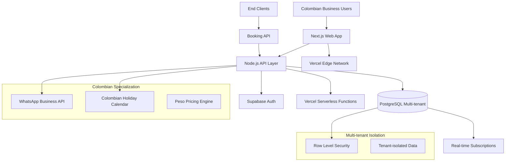

# System Overview

## Introduction

This document outlines the high-level architecture for the **Colombian Appointment Management System**, a **Colombian-first platform** designed for service businesses operating in Colombia. The system prioritizes **pragmatic technology choices** using proven technologies over cutting-edge solutions to ensure reliability within the 6-month MVP timeline.

## Project Context

**Project Type:** Greenfield project  
**Timeline:** 6-month MVP development  
**Team Size:** 2-3 developers  
**Market Focus:** Colombian service businesses  

### Why Greenfield?

Based on comprehensive analysis, this requires a greenfield approach due to:
- **Colombian Market Specialization**: Holiday calendar integration, peso pricing, and WhatsApp-first communication
- **Multi-tenant Architecture**: Complete business isolation with zero cross-tenant visibility  
- **Scheduling Engine Complexity**: 15-minute granular scheduling with real-time conflict prevention
- **Bootstrap Constraints**: Small team with tight timeline favors custom solution over template adaptation

## High Level Architecture

### Technical Summary

The Colombian Appointment Management System employs a **modular monolithic architecture** deployed as serverless functions, combining development simplicity needed for a small team with scalability required for 500+ business accounts.

Key architectural decisions:
- **TypeScript-based fullstack** with Next.js frontend and Node.js backend
- **Multi-tenant PostgreSQL database** with Row Level Security for complete business isolation
- **Vercel + Supabase platform** for optimal Colombian market performance
- **Real-time conflict prevention** through Supabase realtime subscriptions
- **Colombian market specialization** as core architectural principle

### Platform and Infrastructure Choice

**Platform:** Vercel + Supabase  
**Key Services:** 
- Vercel (hosting/serverless functions)
- Supabase (PostgreSQL/Auth/Realtime)
- Vercel Analytics & Supabase Edge Functions

**Deployment:** 
- Vercel Edge Network with Supabase São Paulo region for optimal Colombian latency
- GitHub Actions CI/CD pipeline
- Environment-based deployments (dev/staging/production)

### Repository Structure

**Structure:** Monorepo using npm workspaces  
**Monorepo Tool:** npm workspaces (built-in, no additional tooling complexity)  
**Package Organization:** Apps (web, api) + shared packages (types, utils, ui components)

Benefits:
- Shared TypeScript interfaces between frontend and backend
- Centralized dependency management  
- Atomic deployments of related changes
- Colombian-specific utilities (holiday calendar, peso formatting) as shared packages

### High Level Architecture Diagram

## Architectural Patterns

### Core Patterns

- **Jamstack Architecture:** Static site generation with serverless APIs
  - *Rationale:* Optimal performance for Colombian internet infrastructure while maintaining real-time capabilities

- **Component-Based UI:** Reusable React components with TypeScript
  - *Rationale:* Maintainability and type safety across calendar interfaces and booking forms

- **Repository Pattern:** Abstract data access logic with tenant isolation
  - *Rationale:* Enables testing and future migration flexibility while enforcing multi-tenant security

- **API Gateway Pattern:** Single entry point through Next.js API routes
  - *Rationale:* Centralized auth, rate limiting, and monitoring for booking operations

### Domain-Driven Patterns

- **Domain-Driven Design:** Colombian business entities as first-class objects
  - *Rationale:* Align code structure with Colombian appointment management domain

- **Event-Driven Updates:** Real-time availability updates via Supabase realtime
  - *Rationale:* Prevent booking conflicts through live data synchronization

- **Optimistic Locking:** Pessimistic locking for booking transactions
  - *Rationale:* Guarantee zero double-booking at the cost of slight performance impact

## Architecture Principles

### 1. Colombian-First Design
Every architectural decision considers Colombian market requirements first:
- Phone number formatting (+57 prefix)
- Colombian peso pricing (integer-based, no decimals)
- National holiday calendar integration
- WhatsApp Business API as primary communication channel

### 2. Multi-Tenant Security
Complete business isolation at every level:
- Database-level Row Level Security (RLS) policies
- Business context in every API call
- Zero cross-tenant data visibility
- Tenant-aware error handling and logging

### 3. Zero Double-Booking Guarantee
Conflict prevention through multiple layers:
- Database unique constraints on (business_id, specialist_id, date, time)
- Real-time availability updates
- Pessimistic locking for booking transactions
- 15-minute granularity enforcement

### 4. Progressive Enhancement
Architecture enables scaling from simple MVP to sophisticated platform:
- Modular component design
- Extensible API patterns
- Database schema designed for feature expansion
- Performance optimization ready for scale

### 5. Development Velocity
Optimized for small team productivity:
- TypeScript everywhere prevents integration bugs
- Shared types between frontend and backend
- Minimal DevOps overhead through managed services
- Fast local development setup

## Next Steps

1. **Review Technology Stack**: See [Technology Stack](./02-tech-stack.md) for detailed technology choices
2. **Understand Data Layer**: Review [Data Models](./03-data-models.md) and [Database Schema](./04-database-schema.md)
3. **Explore API Design**: Check [API Specification](./05-api-specification.md)
4. **Frontend Patterns**: See [Frontend Architecture](./06-frontend-architecture.md)
5. **Implementation Guide**: Follow [Infrastructure Setup](./07-infrastructure.md) for Epic 1

---

*This document provides the foundational architectural vision. Detailed implementation guidance is available in the other architecture documents.*